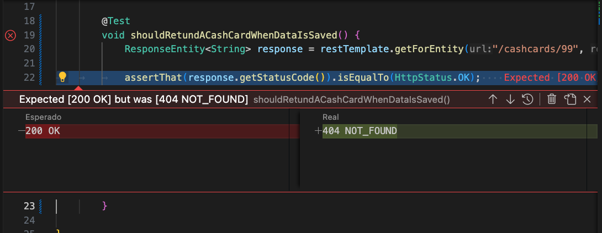
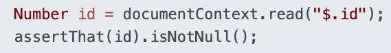
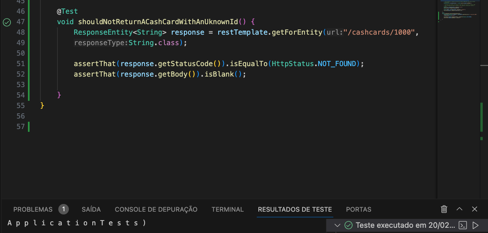

# Construindo API REST com Spring Boot

Spring e Spring Boot são estruturas Java usadas para construir aplicativos. Como kits de ferramentas que ajudam os desenvolvedores a construir e estruturar seu código de maneira eficiente e escalável.

    Spring é uma estrutura abrangente que 
    fornece vários módulos para a construção de diferentes tipos de aplicativos. 
    É como ter uma caixa de ferramentas gigante com todas as ferramentas
    que você precisa para construir o que quiser
À medida que construímos a API Family Cash Card, usaremos Spring MVC para a aplicação web, Spring Data para acesso a dados e Spring Security para autenticação e autorização.

#### O Spring Boot torna o trabalho com o Spring muito mais simples.
Spring Boot é uma versão mais opinativa do Spring. Ele vem com muitas configurações e dependências pré-configuradas que são comumente usadas em aplicativos Spring. Isso torna muito fácil começar rapidamente, sem ter que se preocupar em configurar tudo do zero. 
#### Além disso, o Spring Boot vem com um servidor web integrado, para que você possa criar e implantar facilmente aplicativos web sem precisar de um servidor externo.

###  Inversão do contêiner de controle do Spring.  
#### Spring Boot permite configurar como e quando as dependências são fornecidas ao seu aplicativo em tempo de execução. Isso coloca você no controle de como seu aplicativo opera em diferentes cenários.

#### Spring Boot aproveita o contêiner Inversion of Control (IoC) do Spring Core.
### Por exemplo,
#### Você pode querer usar um banco de dados diferente para desenvolvimento local e para seu aplicativo ativo voltado ao público. O código do seu aplicativo não deve se preocupar com essa distinção; se isso acontecesse, você teria que codificar todos os cenários possíveis na lógica do seu aplicativo. Em vez disso, o Spring Boot permite fornecer uma configuração externa que especifica como e quando tais dependências são usadas.

#### Estamos deixando essa distinção clara porque muitas linguagens e estruturas de software implementam IoC, mas não necessariamente chamam isso de “injeção de dependência”. No entanto, na comunidade Spring, você frequentemente ouvirá os termos usados ​​de forma intercambiável.

#### A inversão de controle costuma ser chamada de injeção de dependência (DI), embora isso não seja estritamente correto. A injeção de dependência e as estruturas que a acompanham são uma forma de obter inversão de controle, e os desenvolvedores do Spring frequentemente afirmam que as dependências são "injetadas" em seus aplicativos em tempo de execução.


## Inicialização Spring
### Spring Initializr
Ao iniciar um novo aplicativo Spring Boot, Spring Initializr é a primeira etapa recomendada. Você pode pensar no Spring Initializr como um carrinho de compras para todas as dependências que seu aplicativo possa precisar. Ele irá gerar de forma rápida e fácil um aplicativo Spring Boot completo e pronto para execução.
#### O fluxo geral do Spring Initializr é preencher os metadados, adicionar dependências relevantes e gerar seu novo projeto.
#### Para configurar o aplicativo Family Cash Card REST API.


#### Após isso, ao abrir o arquivo zip na IDE a saída mostra que o aplicativo passou nos testes e foi construído com sucesso.


## Contratos de API e JSON

#### Estamos desenvolvendo uma API. Isso levanta muitas questões sobre como a API deve se comportar:
- Como os consumidores da API devem interagir com a API?
- Quais dados os consumidores precisam enviar em vários cenários?
- Quais dados a API deve retornar aos consumidores e quando?
- O que a API comunica quando é usada incorretamente (ou algo dá errado)?
#### Sempre que possível, os fornecedores e consumidores de API devem discutir estes cenários e chegar a acordos. Melhor ainda, devem documentar estes acordos não apenas num sistema de documentação partilhada, mas também de uma forma que apoie a aprovação (ou reprovação) de testes automatizados com base nestas decisões.

### Contratos de API
#### A indústria de software adotou vários padrões para capturar o comportamento acordado da API na documentação e no código. Esses acordos são frequentemente chamados de “contratos”. Dois exemplos incluem Contratos Orientados ao Consumidor e Contratos Orientados ao Fornecedor.

#### Definimos um contrato de API como um acordo formal entre um fornecedor de software e um consumidor que comunica abstratamente como interagir entre si. Este contrato define como os provedores de API e os consumidores interagem, como são as trocas de dados e como comunicar casos de sucesso e falha.

#### O provedor e os consumidores não precisam compartilhar a mesma linguagem de programação, apenas os mesmos contratos de API. Para o domínio Family Cash Card, vamos supor que atualmente exista um contrato entre o serviço Cash Card e todos os serviços que o utilizam. Abaixo está um exemplo desse primeiro contrato de API.


## Por que os contratos de API são importantes?
#### Os contratos de API são importantes porque comunicam o comportamento de uma API REST. Eles fornecem detalhes específicos sobre os dados que estão sendo serializados (ou desserializados) para cada comando e parâmetro sendo trocados. Os contratos de API são escritos de forma que possam ser facilmente traduzidos em funcionalidade de provedor e consumidor de API e testes automatizados correspondentes.

## O que é JSON?
#### JSON (Javascript Object Notation) fornece um formato de intercâmbio de dados que representa as informações específicas de um objeto em um formato que você pode ler e entender facilmente. Usaremos JSON como formato de intercâmbio de dados para a API Family Cash Card.


Quando comparado ao XML, o JSON lê e grava mais rápido, é mais fácil de usar e ocupa menos espaço. Você pode usar JSON com a maioria das linguagens de programação modernas e em todas as principais plataformas. Também funciona perfeitamente com aplicativos baseados em Javascript.

Por essas razões, o JSON substituiu amplamente o XML como o formato mais amplamente usado para APIs usadas por aplicativos Web, incluindo APIs REST.

### Os contratos de API são um meio popular para provedores e consumidores de API concordarem sobre como uma API se comportará.
#### Os contratos de API podem ser tão simples quanto documentação compartilhada até estruturas sofisticadas de gerenciamento e validação de contratos.

#### Combinados com JSON (o formato de intercâmbio de dados mais popular para aplicativos modernos baseados na Web), os contratos podem ser um meio poderoso para ajudar provedores e consumidores de API a desenvolver e testar APIs.


# Test first:
## O que é desenvolvimento orientado a testes?
#### É comum que as equipes de desenvolvimento de software criem conjuntos de testes automatizados para se protegerem contra regressões. Frequentemente, esses testes são escritos após a criação do código do recurso do aplicativo. Adotaremos uma abordagem alternativa: escreveremos testes antes de implementar o código da aplicação. Isso é chamado de desenvolvimento orientado a testes (TDD).

### Por que aplicar TDD?
#### Ao afirmar o comportamento esperado antes de implementar a funcionalidade desejada, estamos projetando o sistema com base no que queremos que ele faça, e não no que o sistema já faz.

#### Outro benefício do “test-drive” do código do aplicativo é que os testes orientam você a escrever o código mínimo necessário para satisfazer a implementação. Quando os testes são aprovados, você tem uma implementação funcional (o código do aplicativo) e uma proteção contra a introdução de erros no futuro (os testes).

## A Pirâmide de Teste
#### Diferentes testes podem ser escritos em diferentes níveis do sistema. Em cada nível, existe um equilíbrio entre a velocidade de execução, o “custo” para manter o teste e a confiança que ele traz para a correção do sistema. Esta hierarquia é frequentemente representada como uma “pirâmide de testes”.


### Testes de Unidade: 
#### Um Teste de Unidade exercita uma pequena “unidade” do sistema que está isolada do resto do sistema. Eles devem ser simples e rápidos. Você deseja uma alta proporção de testes de unidade em sua pirâmide de testes, pois eles são essenciais para projetar software altamente coeso e pouco acoplado.

### Testes de Integração: 
#### Os Testes de Integração exercitam um subconjunto do sistema e podem exercitar grupos de unidades em um teste. Eles são mais complicados de escrever e manter e são executados mais lentamente que os testes unitários.

### Testes ponta a ponta ou e2e: 
#### Um teste ponta a ponta exercita o sistema usando a mesma interface que um usuário usaria, como um navegador da web. Embora extremamente completos, os testes ponta a ponta podem ser muito lentos e frágeis porque usam interações simuladas do usuário em interfaces de usuário potencialmente complicadas. Implemente o menor número desses testes.


## O loop de refatoração vermelho, verde
#### Melhorando e simplificando continuamente sua refatoração de código. Uma das únicas maneiras de refatorar com segurança é quando você tem um conjunto de testes confiável. Assim, o melhor momento para refatorar o código que você está focando atualmente é durante o ciclo TDD. Isso é chamado de ciclo de desenvolvimento Vermelho, Verde e Refatorar:

 ## 1. Vermelho
```bash
Escreva um teste com falha para a funcionalidade desejada.
```
 ## 2. Verde
```bash
Implemente a coisa mais simples que pode funcionar para fazer o teste passar.
```
 ## 3. Refatorar
#### Procure oportunidades para simplificar, reduzir a duplicação ou melhorar o código de outra forma sem alterar qualquer comportamento

#### Aqui abordaremos uma breve introdução à biblioteca de testes JUnit e à ferramenta de construção Gradle. Também usaremos a abordagem Test-First para construir software.

## A seguir,
### implementaremos os testes de unidade usando TDD para os contratos JSON que usaremos ao desenvolver nossa API Family Cash Card.
#### Escreva um teste com falha
#### Use TDD para testar um contrato de dados JSON
#### Use TDD para testar a desserialização JSON
___________________________________________________________________


## Escrevendo um teste que falhou:
#### ( Aqui, abordaremos uma breve introdução à biblioteca de testes JUnit e à ferramenta de compilação do Gradle.

#### Classes de teste em um projeto Java padrão estão no diretório src/test, não src/main. No nosso caso, decidimos colocar nosso código no pacote example.cashcard, então nossos arquivos de teste devem estar no diretório src/test/java/example/cashcard.


 #### A primeira coisa que precisamos fazer é criar nossa nova classe de teste no diretório src/test/java/example/cashcard.

#### A anotação @Test faz parte da biblioteca JUnit e o método assertThat faz parte da biblioteca AssertJ.


#### Na verdadeira moda Test-First, escrevemos um teste falhando primeiro. É importante ter um teste de falha primeiro para que você possa ter alta confiança de que o que você fez para corrigir o teste realmente funcionou.

#### Essa é a saída esperada da ferramenta de compilação do Gradle quando você tem um teste com falha:


### Test sucesso


#### Testando o contrato de dados
Agora, vamos escrever um teste que faça sentido para o nosso objetivo: escrever o cashcard REST API.

A anotação @JsonTest marca o CashCardJsonTest como uma classe de teste que usa o framework Jackson (que é incluído como parte do Spring). Isto fornece um suporte extensivo a testes e análises JSON. Também estabelece todo o comportamento relacionado para testar objetos JSON.

O JacksonTester é um invólucro de conveniência para a biblioteca de análise de Jackson JSON. Ele lida com a serialização e deserialização de objetos JSON.

@Autowired é uma anotação que direciona o Spring para criar um objeto do tipo solicitado.\


#### Para criar uma classe cashcard e o construtor que é usado no teste cashCardSerializationTest(), crie o ficheiro src/main/java/example/cashcard/CashCard.java com o seguinte conteúdo (repare que este ficheiro está no diretório src/main, não no diretório src/test):


1. ### Crie um arquivo chamado expected.json
2. ### src/test/resources/example/cashcard/expected.json.
3. #### Edite o arquivo .json esperado recém-criado e insira {} como o único conteúdo. Estamos propositadamente apenas incluindo um documento JSON vazio, o que fará com que o teste falhe.
___________________________________________________________________________________________________________________________________________________________

## Testing Deserialization

#### A desserialização é o processo inverso da serialização. Transforma os dados de um ficheiro ou fluxo de bytes de volta num objecto para a sua aplicação. Isso torna possível que um objeto serializado em uma plataforma seja desserializado em uma plataforma diferente. Por exemplo, seu aplicativo cliente pode serializar um objeto no Windows enquanto o back-end o deseriliza no Linux.

#### A serialização e a desserialização trabalham juntas para transformar/recriar objetos de dados de/para um formato portátil. O formato de dados mais popular para serializar dados é o JSON.

#### Vamos escrever um segundo teste para desserilizar dados para que ele converta de JSON para Java após o primeiro teste passar. Este teste usa uma técnica de teste em que você escreve propositadamente um teste falhado. Especificamente: os valores de id e quantidade não são o que se espera.


Successful

###

_________________________________________________________


## Implementando GET
>>REST, CRUD E HTTP

Vamos começar com uma definição concisa de REST : Representational State Transfer. Em um sistema RESTful, os objetos de dados são chamados de Representações de Recursos. O objetivo de uma API RESTful (Application Programming Interface) é gerenciar o estado desses recursos.
Dito de outra forma, você pode pensar em “estado” como “valor” e “Representação de Recursos” como um “objeto” ou “coisa”. Portanto, REST é apenas uma forma de gerenciar os valores das coisas. Essas coisas podem ser acessadas por meio de uma API e geralmente são armazenadas em um armazenamento de dados persistente, como um banco de dados.


#### Um conceito frequentemente mencionado quando se fala em REST é CRUD . CRUD significa “Criar, Ler, Atualizar e Excluir”. Estas são as quatro operações básicas que podem ser executadas em objetos em um armazenamento de dados.

#### Outro conceito comum associado ao REST é o Protocolo de Transferência de Hipertexto. Em HTTP , um chamador envia uma solicitação para um URI. Um servidor web recebe a solicitação e a encaminha para um manipulador de solicitações. O manipulador cria uma resposta, que é então enviada de volta ao chamador.

#### Os componentes da Solicitação e Resposta são:

#### Solicitar
- Método (também chamado de Verbo)
- URI (também chamado de Endpoint)
- Corpo

#### Resposta
- Código de status
- Corpo
#### O poder do REST está na maneira como ele faz referência a um recurso e na aparência da solicitação e da resposta para cada operação CRUD.

- Para C REATE: use o método HTTP POST.
- Para R EAD: use o método HTTP GET.
- Para U PDATE: use o método HTTP PUT.
- Para D ELETE: use o método HTTP DELETE.

#### O URI do terminal para objetos Cash Card começa com a /cashcardspalavra-chave. READ, UPDATEe DELETEas operações exigem que forneçamos o identificador exclusivo do recurso de destino. O aplicativo precisa desse identificador exclusivo para executar a ação correta exatamente no recurso correto. Por exemplo, para READ, UPDATE, ou DELETEum Cash Card com o identificador "42", o ponto final seria /cashcards/42.

#### Observe que não fornecemos um identificador exclusivo para a CREATE operação. Como aprenderemos com mais detalhes em lições futuras, CREATE terá o efeito colateral de criar um novo Cash Card com um novo ID exclusivo. Nenhum identificador deve ser fornecido ao criar um novo Cash Card porque o aplicativo criará um novo identificador exclusivo para nós.
#### O gráfico abaixo traz mais detalhes sobre as operações RESTful CRUD.


## O Corpo da Solicitação
#### Ao seguir as convenções REST para criar ou atualizar um recurso, precisamos enviar dados para a API. Isso geralmente é chamado de corpo da solicitação . As operações CREATE e UPDATE exigem que um corpo de solicitação contenha os dados necessários para criar ou atualizar adequadamente o recurso. Por exemplo, um novo Cash Card pode ter um valor inicial em dinheiro e uma UPDATE operação pode alterar esse valor.

### Exemplo de cartão de dinheiro
#### Vamos usar o exemplo de um endpoint de leitura. Para a operação de leitura, o caminho do URI (endpoint) é /cashcards/{id}, onde {id}é substituído por um identificador real do Cash Card, sem chaves, e o método HTTP é GET.
#### Nas GET solicitações, o corpo fica vazio. Então, a solicitação de leitura do Cash Card com id 123 seria:


#### A resposta a uma solicitação de leitura bem-sucedida possui um corpo contendo a representação JSON do recurso solicitado, com um código de status de resposta 200 (OK). Portanto, a resposta à solicitação de leitura acima seria assim:


____________________________________________________________________________________________________________________________________________________________________________________________________________________________________________________________________________________________________


### Anotações Spring e verificação de componentes
#### Uma das principais coisas que o Spring faz é configurar e instanciar objetos. Esses objetos são chamados Spring Beans e geralmente são criados pelo Spring (em vez de usar a newpalavra-chave Java). Você pode direcionar o Spring para criar Beans de várias maneiras.

#### Controladores Web Spring
#### No Spring Web, as solicitações são tratadas por controladores.
#### @RestController class CashCardController {
}

#### Isso é tudo o que é preciso para dizer ao Spring: “crie um controlador REST”. O Controlador é injetado no Spring Web, que roteia as solicitações de API (tratadas pelo Controlador) para o método correto.


#### Um método Controller pode ser designado como um método manipulador, a ser chamado quando uma solicitação que o método sabe como tratar (chamada de “solicitação de correspondência”) é recebida. 
#### Aqui está um começo:


#### Como o REST diz que os endpoints de leitura devem usar o método HTTP GET, você precisa dizer ao Spring para rotear solicitações para o método apenas nas solicitações GET. Você pode usar a anotação @GetMapping , que precisa do caminho URI:


#### Spring precisa saber como obter o valor do parâmetro requestedId. Isso é feito usando a anotação @PathVariable. O fato do nome do parâmetro corresponder ao texto {requestedId} dentro do parâmetro @GetMapping permite que o Spring atribua (injete) o valor correto à variável requestedId:


#### REST diz que a resposta precisa conter um Cash Card em seu corpo e um código de resposta 200 (OK). Spring Web fornece a classe ResponseEntity para essa finalidade. Ele também fornece vários métodos utilitários para produzir Entidades de Resposta. Aqui, você pode usar ResponseEntity para criar um ResponseEntity com código 200 (OK) e um corpo contendo um arquivo CashCard. A implementação final é assim:


_________________________________________________________________________________________________________________

### Escrevendo um test de inicialização do Spring para o endpoint GET


#### Vamos entender vários elementos importantes neste teste.

#### Isso iniciará nosso aplicativo Spring Boot e o disponibilizará para nosso teste para executar solicitações a ele.
________________________________________________________________________________________________________________________

#### Pedimos ao Spring para injetar um auxiliar de teste que nos permitirá fazer solicitações HTTP para o aplicativo em execução localmente.
##### Mesmo que @Autowired seja uma forma de injeção de dependência do Spring, é melhor usá-lo apenas em testes
____________________________________________________________________________________________________________________________________________

#### Aqui usamos restTemplate para fazer uma solicitação HTTP GET para o nosso terminal de aplicação /cashcards/99.
#### O restTemplate retornará um ResponseEntity, que capturamos em uma variável que nomeamos response. ResponseEntity é outro objeto Spring útil que fornece informações valiosas sobre o que aconteceu com o nosso pedido. 
____________________________________________________________________________________________________________________________________________________________________________________________________________________________

#### Podemos inspecionar muitos aspectos da resposta, incluindo o código HTTP Response Status, que esperamos ser 200 OK.
______________________________________________________________________________________________________________________________________
### Falhará, 
#### como esperado. Por quê? Como aprendemos na prática do primeiro teste, descrevemos nossas expectativas antes de implementar o código que satisfaz essas expectativas.

#### Entenda a falha do teste.
#### Como explicamos, esperávamos que nosso teste falhasse no momento.
#### Por que está falhando devido a um código de resposta HTTP NOT_FOUND 404 inesperado?

#### Resposta: Como não instruímos o Spring Web como lidar com GET cashcards//99, o Spring Web está respondendo automaticamente que o endpoint é NOT_FOUND.
________________________________________________________________________________________________________________________________________________________
### Criando um controlador REST
#### Spring Web Controllers são projetados para lidar e responder a solicitações HTTP.

#### Run test...

#### Apesar do nome, CashCardController não é realmente um Spring Web Controller; é apenas uma classe com Controller no nome. Assim, não irá "escutar" nossas solicitações HTTP. Portanto, precisamos dizer ao Spring para disponibilizar o Controlador como um Controlador Web para lidar com solicitações de cashcards/* URLs.

#### Vamos atualizar nosso CashCardController para que ele esteja configurado para ouvir e lidar com solicitações HTTP para /cashcards.

#### Entenda as anotações da Spring Web.
#### @RestController Isso diz ao Spring que esta classe é um componente do tipo RestController e capaz de lidar com solicitações HTTP.
#### @RequestMapping("/cashcards") este é um companheiro para @RestController que indica quais solicitações de endereço devem ter acesso a este controlador.
#### @GetMapping("/{requestedId}") private ResponseEntity<String> findById() {...}
#### @GetMapping marca um método como um método manipulador. As solicitações GET que correspondem a cashcards/{requestedID} serão tratadas por este método.

#### Até aqui, nosso teste apenas afirma que a solicitação foi bem-sucedida, verificando o status de resposta 200 OK. Em seguida, vamos testar se a resposta contém os valores corretos

#### Atualizando o test:

 Isso converte a resposta String em um objeto JSON-aware com muitos métodos auxiliares.
 Esperamos que quando solicitamos um Cash Card com id de 99, um objeto JSON será retornado com algo no campo id. Por enquanto, afirme que o id não é nulo.

#### Execute o teste -- e observe a falha. Como retornamos um objeto JSON vazio {} não devemos nos surpreender que o campo id esteja vazio.

#### Como retornamos um objeto JSON vazio {} não devemos nos surpreender que o campo id esteja vazio.

#### Vamos fazer o teste passar, mas retornar algo intencionalmente errado, como 1000L.
#### Além disso, vamos utilizar a classe de modelo de dados cashcard que criamos em uma lição anterior.


#### Ele passa! No entanto - ele se sente correto? Não exatamente. Ter o passe de teste com dados incorretos parece errado.
#### Pedimos que retornasse intencionalmente um id incorreto de 1000L para ilustrar um ponto: É importante que os testes passem ou falhem pelo motivo certo.
#### Atualize o teste para afirmar que o id está correto e execute novamente os testes e observe a nova mensagem de falha.

#### Agora, o teste está falhando pelo motivo certo: Nós não retornamos o id correto.

#### Atualize CashCardController para retornar o id correto.

#### Eles passam!
_______________________________________________________________________________________________________________________________________

### Teste a quantidade.
#### Em seguida, vamos adicionar uma afirmação para o valor indicado pelo contrato JSON.

#### Execute os testes e observe a falha.

#### Vamos atualizar o CashCardController para devolver o valor indicado pelo contrato JSON.


____________________________________________________________

### Usando o @PathVariable.
#### Até agora, ignoramos o requestedId no método Controller.
#### Vamos usar essa variável de caminho em nosso Controller para garantir que retornamos o Cash Card correto.
#### Vamos escrever um novo teste que espera ignorar Cash Cards que não têm um id de 99. Use 1000, como temos em testes anteriores.

#### Observe que estamos esperando um código de status de resposta HTTP semântico de 404 NOT_FOUND. Se solicitarmos um Cash Card que não existe, esse Cash Card é de fato "não encontrado".

#### Execute o teste e anote o resultado.

### Adicione @PathVariable.

#### Vamos fazer o teste passar fazendo com que o Controlador retorne o Cash Card específico somente se enviarmos o identificador correto.

#### Para fazer isso, primeiro torne o Controller ciente da variável de caminho que estamos enviando, adicionando a anotação @PathVariable ao argumento do método handler

#### @PathVariable torna o Spring Web ciente do requestedId fornecido na solicitação HTTP. Agora ele está disponível para nós usarmos em nosso método handler.

#### Atualize o método handler para retornar uma resposta vazia com status NOT_FOUND, a menos que o requestedId seja 99.

Run test...

#### Nesta lição, aprendemos como usar o desenvolvimento orientado a testes para criar o endpoint REST do Family Cash Card: um GET que retorna um cashcard de uma determinada ID.
__________________________________________________________
